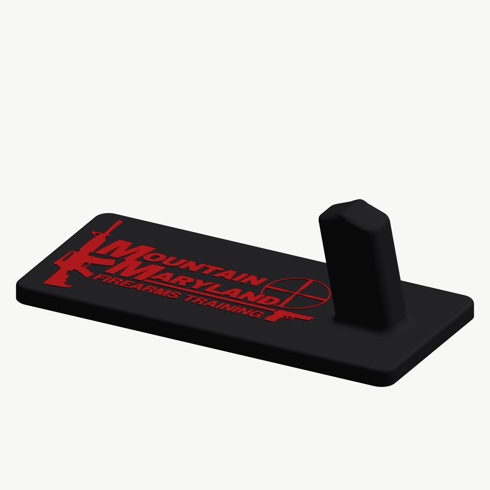
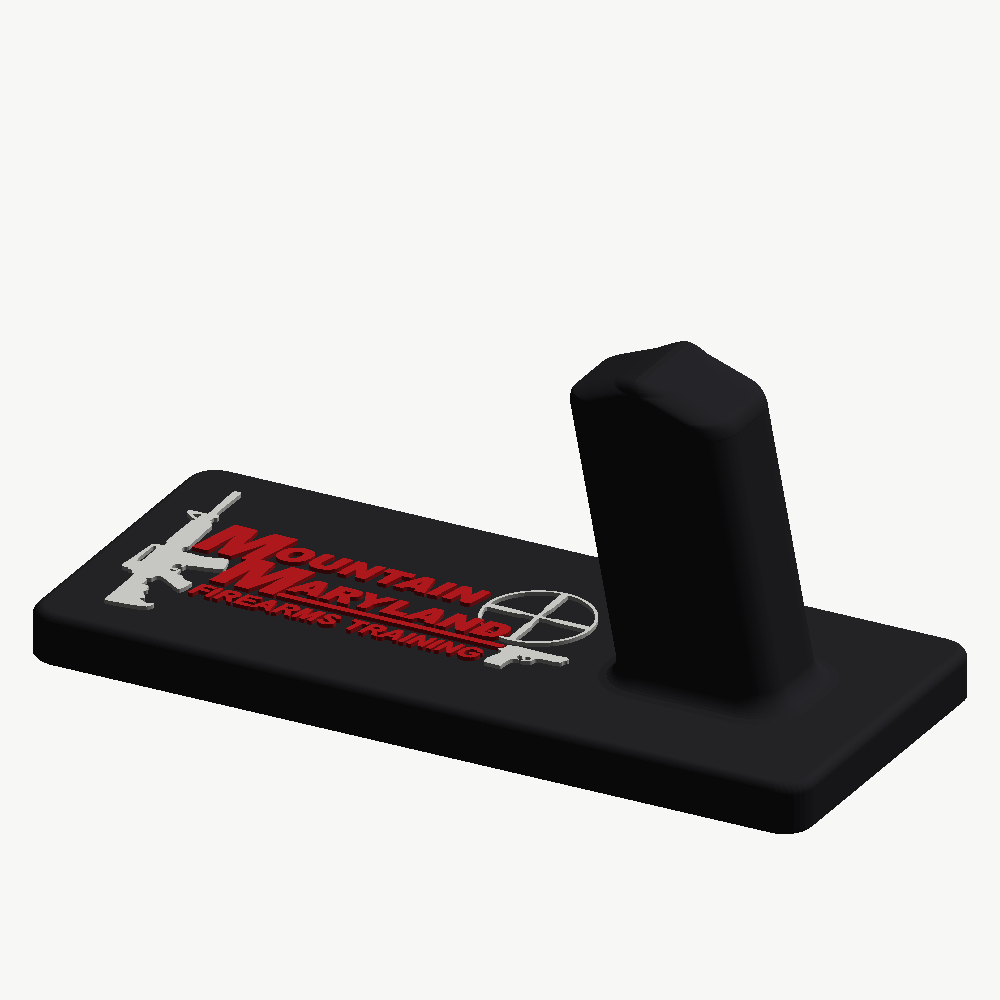
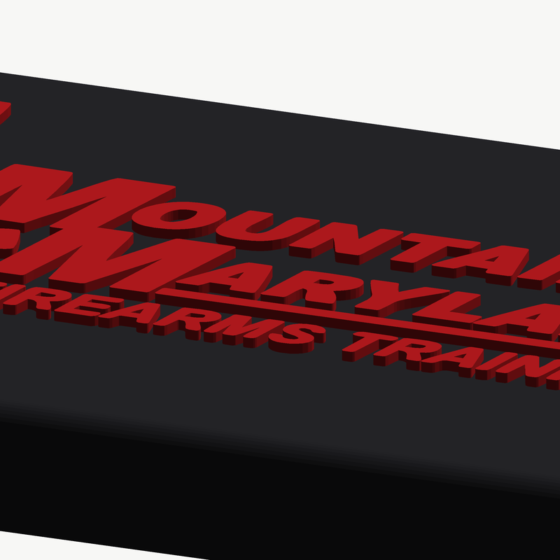
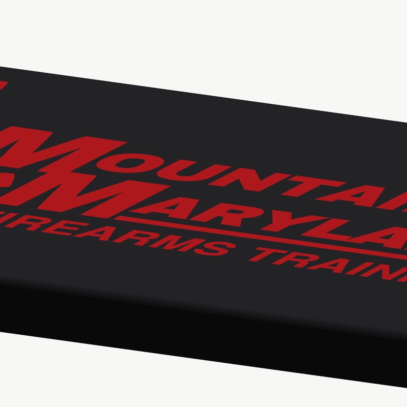

# MMFT-STL

3D-printable models for **Mountain Maryland Firearms Training**.

## Pistol display stand

A counter-top display stand: a filleted base plate with a leaning
magazine-well blade at one end and the MMFT mark standing proud of the plate
in front of it. Designed to print in a black body with the mark in red.



| | |
|---|---|
|  |  |
| Two colours — black and red | Three colours — lettering red, firearms bone |

**215 × 98 × 70.6 mm.** No supports, no bridging, flat on the plate.

Sized up from an earlier 160 × 70 after a test print: at that size the gaps
*between* the letters were narrower than a nozzle could lay a bead into, so
they filled in and the lettering came out ragged. The mark is now 145 mm
wide instead of 90, and the narrowest gap in it is 0.460 mm.

**Print it with a 0.4 mm nozzle.** That number is why: a 0.6 mm nozzle lays
a bead wider than the gap and fuses four separate pieces of the mark into
one blob, and no slicer setting can undo it.

One thing to know before these go on a counter: the stand is enormously
stronger than it needs to be, but it tips sideways at about 0.65 lbf, and
**infill does not fix that** — see
[Will it stay put](docs/PRINTING.md#will-it-stay-put).

### Raised or flush

The mark comes two ways. Both look the same from straight on; they differ
in whether it stands on the plate or is let into it.

|  |  |
|---|---|
| **`stl/raised/`** — stands 0.6 mm proud | **`stl/flush/`** — let 0.6 mm into the plate |

**Flush is the one to print for a shop counter.** Nothing stands above the
surface to be caught or chipped, and every piece of the mark is boxed in on
all four sides by the black around it — a muzzle dragged across it just
slides. It needs a multi-material printer, because black and red share the
same three layers.

**Raised** is there because it prints in two colours on *any* printer. Every
layer above the plate is mark and nothing else, so a single extruder only
needs a filament change at Z = 9.6 mm and another at Z = 10.2 mm. The
trade-off is that two pieces are small — the slivers of the scope's
crosshair showing through "ND", at 0.71 and 1.02 mm², which is not much
holding a 0.6 mm tall nub. Everything else is far sturdier since the mark
was scaled up; the smallest piece of lettering is now 9.6 mm².

### One file, or several

**`3mf/` holds the whole model as a single file per variant** — parts kept
together, colours already set, nothing to line up. Open one and print:

| File | Parts |
|---|---|
| `3mf/MMFT_Stand_flush_2color.3mf` | black body + red mark |
| `3mf/MMFT_Stand_flush_3color.3mf` | black body + red lettering + bone firearms |
| `3mf/MMFT_Stand_raised_2color.3mf` | black body + red mark |
| `3mf/MMFT_Stand_raised_3color.3mf` | black body + red lettering + bone firearms |

**This cannot be done as an STL.** An STL file is a bare list of triangles
with no notion of colour, material, or even where one body ends and the next
begins — so a two-colour model has to travel as two STLs and be lined up
again at the other end. 3MF is the format that fixes exactly that, and every
current slicer reads it. As a bonus the whole two-colour project is 0.65 MB
against 3.4 MB for the equivalent pair of STLs.

Inside, the parts are written as *components of one object* rather than as
separate objects side by side. That matters: as separate objects a slicer is
free to move them independently, and a single auto-arrange would slide the
mark off the plate it belongs to. As components they move together and
cannot come apart.

Colours are carried twice — `<basematerials>`, which is the core 3MF way any
slicer reads, and `Metadata/model_settings.config`, the Bambu Studio and
Orca convention where each part names the filament slot it wants. If your
slicer understands neither, you still get the geometry and the separate
parts, and assigning the filaments by hand is a couple of clicks.

Bambu Studio greets any non-Bambu 3MF with *"The 3mf file has invalid
config, load geometry data only"*. That is about the print profile, not the
model, and these files carry no print profile on purpose — see
[docs/PRINTING.md](docs/PRINTING.md).

### STL files

Still here for anything that will not take a 3MF, and for single-colour
prints where one body is all you need.

| File | Colour | Set |
|---|---|---|
| `raised/MMFT_Stand_black_body.stl` | black | 2- and 3-colour |
| `raised/MMFT_Stand_red_logo_full.stl` | red | 2-colour |
| `raised/MMFT_Stand_red_logo_text.stl` | red | 3-colour |
| `raised/MMFT_Stand_light_logo_art.stl` | bone / silver / white | 3-colour |
| `raised/MMFT_Stand_one_piece.stl` | any single colour | on its own |
| `flush/MMFT_Stand_black_body.stl` | black | 2- and 3-colour |
| `flush/MMFT_Stand_red_logo_full.stl` | red | 2-colour |
| `flush/MMFT_Stand_red_logo_text.stl` | red | 3-colour |
| `flush/MMFT_Stand_light_logo_art.stl` | bone / silver / white | 3-colour |
| `flush/MMFT_Stand_engraved_one_piece.stl` | any single colour | on its own |

Every part is modelled in the same coordinate space, so a multi-material
slicer only needs them loaded together and assigned colours — there is
nothing to line up by hand. The flush body and its inlay reassemble into the
solid plate to within a hundred-thousandth of a cubic millimetre, with no
overlap for a slicer to argue with.

`flush/MMFT_Stand_engraved_one_piece.stl` is the flush plate with its
pockets left empty — one colour, nothing proud of the surface at all. The
engraved channels are comfortably printable (the thinnest is 1.72 mm); what
is marginal is the ribs of plate left standing *between* them, the narrowest
of which is 0.46 mm — about one bead wide, so a few will look soft. The
lettering comes through cleanly.

See [docs/PRINTING.md](docs/PRINTING.md) for settings and filament choice.

### How crisp is the mark?

It is traced as vector outlines, not stamped from pixels — straight edges
come out exactly straight (the rule under the wordmark is two points across
46 mm) and the scope ring is round to 0.026 mm RMS, about a fifteenth of an
extrusion width. Nothing in the geometry is stepped.


The preview images are rendered at a size where one pixel is roughly 0.2 mm
of real part, so curves in them can look stepped when the model is not.
`src/preview.py` supersamples to keep that under control.

### The lettering

Two runs in the mark are too small in the source to trace well, for a
reason no amount of work on the tracer can fix. "FIREARMS TRAINING" is
about **34 px** of cap height in the file, and the small caps of the
wordmark about **47 px**. There is no detail there to recover.


*Each pair: traced from the raster, then set from type.*

Both are re-set from outlines instead. Each run was matched the same way —
normalise cap height, solve tracking to match the run's width, score pixel
overlap against the source — then fitted to the box the traced run
occupied, so everything lands where the artwork puts it.

**They are not the same typeface, and that turns out to be the point.**
Stroke-to-cap comes out at 0.176 for the sub-text and 0.265 for the
wordmark: the mark pairs a Bold with a Black. Setting both in one weight
would have flattened that, so each is matched on its own.

| Run | Candidate | Overlap |
|---|---|---|
| Sub-text | **FreeSans Bold Oblique** (Helvetica clone) | **0.871** |
| | Nimbus Sans Bold Italic (Helvetica clone) | 0.870 |
| | Arial metrics (Liberation Sans Bold Italic) | 0.791 |
| Wordmark | **Archivo Black**, condensed 3 % | **0.895** |
| | Archivo weight 900 | 0.870 |
| | Asap weight 900 | 0.865 |
| | any Bold weight | below 0.69 |

The sub-text is Helvetica, near enough. The wordmark is a heavy grotesque
that Archivo Black stands in for: every letter traces 4–7 % narrower than
Archivo draws it, so the original is the narrower face of the two, and
condensing Archivo by 3 % both improves the match and brings the tracking
needed to fill the line back near zero, where the letters stop colliding.

Weight is preserved in both — the sub-text comes out at 1.08 mm median
stroke against the traced 1.05 mm. Only the edges change.

**The two large M's are left as traced.** They are 177 px in the source,
clean enough that setting them would gain nothing, and they are a drawn
lockup rather than two letters set side by side — re-setting them would
have broken the way they interlock.

**If you have the original vector logo** (`.ai`, `.eps`, `.svg` or a vector
`.pdf`), that would beat all of this — send it over and the whole mark can
come from it rather than from a 720 px raster.

### Where the ink/paper boundary is taken

Tracing needs a level at which a grey anti-aliased pixel stops counting as
paper and starts counting as ink. The obvious choice is halfway, and
halfway is wrong for this artwork: it cuts through the middle of the
anti-aliasing and the thinnest closed shapes come apart. The pistol's
trigger guard breaks at the bottom, its opening drains into the
background, and what should be a clean loop prints as a hook with the plate
colour flooding into it. One of the rifle's counters goes the same way.

The level is `ink_level` in `src/logo.py` and sits at **0.70**. That holds
both guards closed for about 4 % more ink overall, and closing them costs
nothing in printability — every gap in the mark still clears a 0.4 mm
nozzle, and the recovered guard opening is 2.1 mm across.

### One thing the re-setting fixed

The scope's crosshair shows through two gaps in "ND", and the artwork holds
it off the letters with a thin white halo. Those two slivers — 0.21 and
0.32 mm² — sit in the wordmark's band, so grouping by position had been
filing them with the lettering. In the three-colour set that meant printing
them red instead of with the rest of the optic. They are now grouped with
the scope, and the re-set letters are cut back by the same 0.35 mm halo the
artwork uses, so the crosshair still reads as passing in front of them.

### Regenerating

The models are generated, not hand-modelled — every dimension is a named
constant near the top of `src/build.py`, and the mark is traced from
`assets/mmft_logo.png` at build time. Change the plate size, move the mark,
swap the artwork, and rebuild:

```sh
pip install -r requirements.txt
python src/build.py      # writes stl/
python src/preview.py    # writes docs/images/
```

| Module | What it does |
|---|---|
| `src/build.py` | Dimensions, the stand, and the exported part sets |
| `src/logo.py` | Traces the logo raster into polygons, splits it into its parts |
| `src/geometry.py` | Rounded rectangles, lofts, extrusions, booleans |
| `src/preview.py` | Renders the images in `docs/images` |

### About the blade

The blade's dimensions are carried over from a Glock-branded stand supplied
as the starting point for this design, so anything that fitted that one fits
this: a 33.67 × 22.84 mm rounded-rectangle section with 6.5 mm corners,
leaning 10.89°, standing 61.1 mm clear of the plate, with a chisel-shaped
lead-in at the tip. The root fillet is opened up from 3.57 mm to 4 mm for
strength. The plate around it and the mark on it are new work, written from
scratch in `src/` — no part of the original mesh is redistributed here.

> If that original model carried a licence, it is worth checking before
> selling prints of this one. The blade section is a functional dimension
> rather than creative expression, but we did take it from somewhere.

### Sizing it to a different pistol

The post stands in for a magazine — it is drawn to the section of one, which
is why it fits a Glock and not a single-stack 1911 or a 2011. Everything
else about the stand is independent of the platform, so a variant is just a
different post on the same base.

`BLADE_NOMINAL_W` and `BLADE_NOMINAL_D` in `src/build.py` are the section as
the magazine well sees it, and `BLADE_RISE` is how far the post stands above
the plate. Change those three and rebuild.

To find out what they should be for a given pistol, print the fit gauge and
try it in the real thing. `stl/gauge/platforms/` holds ten stubs aimed at
specific pistols — Glock, P320, 1911 and brackets for the 2011 family and
the other double stacks; `stl/gauge/` holds a plain size grid for anything
those miss. See [docs/FITTING.md](docs/FITTING.md), which also lists the
magazine sections that could actually be sourced.
